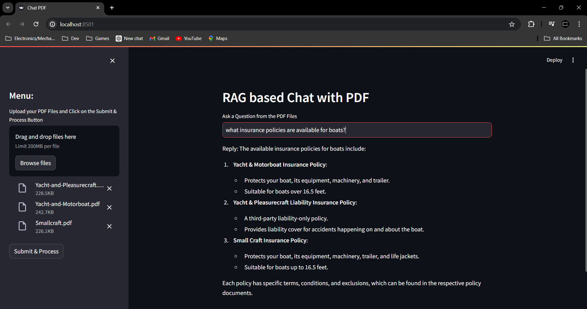

# Multi PDF RAG Chatbot



### Run in a local environment

1. Create a new virtual environment

```sh
py -m venv rag-pdf
```

2. Activate the virtual environment

```sh
.\rag-pdf\Scripts\activate
```

3. Install Python dependencies

```sh
pip install -r requirements.txt
```

4. Create a `.env` file with a OPENAI_API_KEY variable

```sh
OPENAI_API_KEY=<YOUR_OPENAI_API_KEY>
```

5. Run the app

```sh
streamlit run .\app.py
```

### Usefulr URLs

https://python.langchain.com/v0.2/docs/integrations/text_embedding/spacy_embedding/

https://superlinked.com/vector-db-comparison


### Acknowledgement 

https://blog.gopenai.com/building-a-multi-pdf-rag-chatbot-langchain-streamlit-with-code-d21d0a1cf9e5/ 